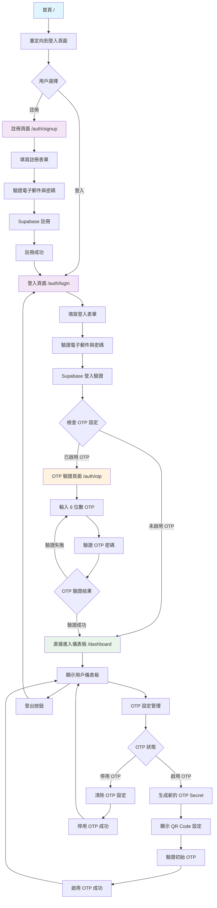

# OTP 登入系統

這是一個基於 [Next.js](https://nextjs.org) 和 Supabase 的 OTP (One-Time Password) 登入系統，支援 Google Authenticator 整合。

## 功能特色

- 🔐 用戶註冊與登入
- 📱 Google Authenticator OTP 驗證
- 🎯 條件式 OTP 驗證（可選擇是否啟用）
- 📊 用戶儀表板
- 🔄 完整的登入流程管理

## 登入流程圖



## 技術架構

- **前端框架**: Next.js 14 (App Router)
- **認證服務**: Supabase Auth
- **OTP 生成**: Speakeasy
- **樣式**: Tailwind CSS
- **語言**: TypeScript

## 專案結構

```
otp-sample/
├── app/                    # Next.js App Router 頁面
│   ├── auth/              # 認證相關頁面
│   │   ├── login/         # 登入頁面
│   │   ├── signup/        # 註冊頁面
│   │   └── otp/           # OTP 驗證頁面
│   ├── dashboard/         # 用戶儀表板
│   └── layout.tsx         # 根布局
├── components/            # React 組件
│   ├── LoginForm.tsx      # 登入表單
│   ├── SignupForm.tsx     # 註冊表單
│   ├── OtpVerify.tsx      # OTP 驗證組件
│   ├── OtpSetting.tsx     # OTP 設定組件
│   └── QRCode.tsx         # QR Code 顯示組件
├── actions/               # Server Actions
│   ├── login.ts           # 登入邏輯
│   ├── signup.ts          # 註冊邏輯
│   ├── otp.ts             # OTP 相關邏輯
│   └── signout.ts         # 登出邏輯
├── utils/supabase/        # Supabase 客戶端配置
└── types/                 # TypeScript 類型定義
```

## Getting Started

First, run the development server:

```bash
npm run dev
# or
yarn dev
# or
pnpm dev
# or
bun dev
```

Open [http://localhost:3000](http://localhost:3000) with your browser to see the result.

## 環境設定

1. 複製 `.env.local.example` 到 `.env.local`
2. 設定 Supabase 專案 URL 和 API Key
3. 確保 Supabase 專案已啟用認證功能

## 使用說明

1. **註冊新用戶**: 訪問 `/auth/signup` 頁面
2. **登入**: 訪問 `/auth/login` 頁面
3. **啟用 OTP**: 在儀表板中開啟 OTP 驗證
4. **掃描 QR Code**: 使用 Google Authenticator 掃描
5. **驗證 OTP**: 輸入 6 位數驗證碼

## Learn More

To learn more about Next.js, take a look at the following resources:

- [Next.js Documentation](https://nextjs.org/docs) - learn about Next.js features and API.
- [Learn Next.js](https://nextjs.org/learn) - an interactive Next.js tutorial.

You can check out [the Next.js GitHub repository](https://github.com/vercel/next.js) - your feedback and contributions are welcome!

## Deploy on Vercel

The easiest way to deploy your Next.js app is to use the [Vercel Platform](https://vercel.com/new?utm_medium=default-template&filter=next.js&utm_source=create-next-app&utm_campaign=create-next-app-readme) from the creators of Next.js.

Check out our [Next.js deployment documentation](https://nextjs.org/docs/app/building-your-application/deploying) for more details.
